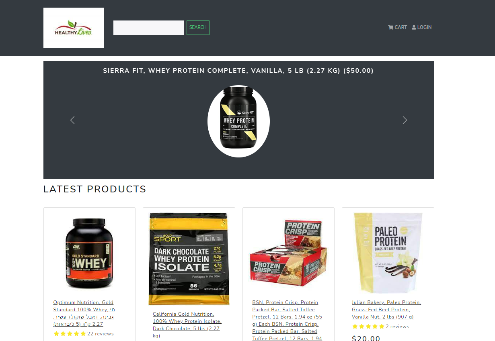

<h1 align=center>E-Commerce Website with Django + React & Redux</h1>
<h2 align=center>Otaku House - Anime Merchandise and Cosplay Shop</h2>

## ✨ [Live Link - Otaku House](https://otakuhouse.herokuapp.com/)

### How to Run 🏃‍♀️

```shell
1 Clone This Repo
2 python -m venv venv
3 .\venv\Scripts\activate
4 pip install -r requirements.txt 
5 python manage.py runserver
6.java -jar selenium-server-4.3.0.jar standalone (use for run selenium grid to run E2E test)
7. java -jar jenkins.war  (use to run a jenkins paltform)


```

### 📷 Project Screenshots




### 🚀 Project Features

A completely customized eCommerce / shopping cart application using Django, REACT and REDUX with the following functionality:

- Full featured shopping cart
- Product reviews and Ratings
- Top products carousel
- Product pagination
- Product search feature
- User profile with orders
- Admin product management
- Admin user management
- Admin Order details page
- Mark orders as a delivered option
- Checkout process (shipping, payment method, etc)
- PayPal / credit card integration
